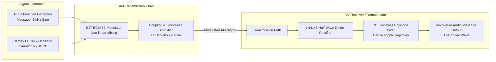
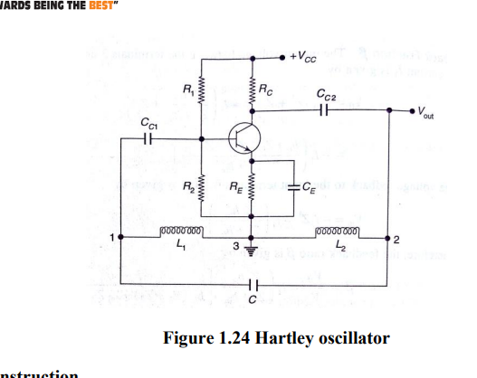
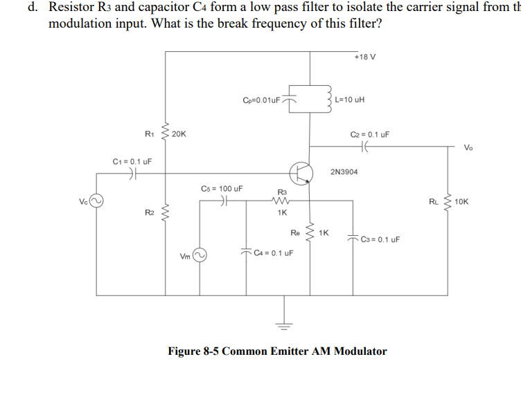
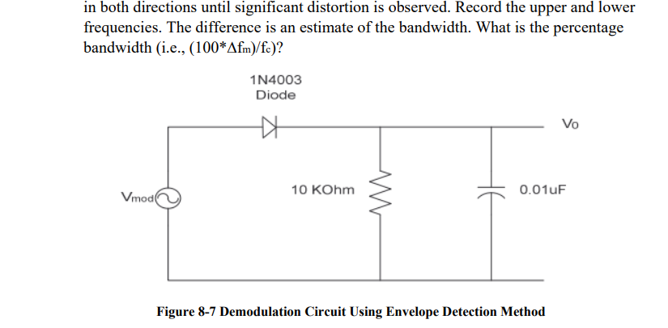

# Amplitude Modulation & Demodulation Circuit

[](https://www.analog.com/en/design-center/design-tools-and-calculators/ltspice-simulator.html)
[]()
[]()
[]()
[]()

A complete analog communication demonstrator system integrating signal generation, non-linear BJT amplitude modulation, low-noise coupling amplification, and RC diode envelope demodulation onto a single platform. The design is optimized for carrier stability and low distortion, verified through LTSpice transient simulations and real-time cathode-ray oscilloscope (CRO) hardware measurements.

---

## Overview

Amplitude Modulation (AM) varies the amplitude of a high-frequency radio-frequency (RF) carrier signal ($V_c$) in direct proportion to the instantaneous amplitude of a low-frequency information message signal ($V_m$).

This project presents the design, component tuning, LTSpice simulation, and physical hardware validation of a discrete AM transceiver system operating from a single +12V DC regulated power supply.

---

## Key Hardware Features

1. **Carrier Generator:** Hartley LC Tank Oscillator ($L_1 = L_2 pprox 6.5	ext{ mH}$, $C_t pprox 0.01\,\mu	ext{F}$) generating a stable $14	ext{ kHz}$ sinusoidal RF carrier.
2. **Message Signal Input:** Low-frequency audio test sine wave ($f_m pprox 1	ext{ kHz}$) applied from an external function generator.
3. **BJT Modulator Stage:** BC547B NPN bipolar junction transistor biased in its non-linear operating region to generate sum and difference sidebands ($f_c \pm f_m$).
4. **Buffer & Low-Noise Amplifier:** DC-blocking coupling capacitors and precision biasing network providing low distortion signal amplification.
5. **Envelope Demodulator Detector:** High-speed 1N4148 switching diode paired with an $RC$ low-pass filter ($R \cdot C$ tuned for carrier ripple rejection) for faithful original message envelope recovery.

---

## System Block Diagram



---

## Component Bill of Materials & Specifications

| Stage / Module | Component Primitive | Part / Rating | Purpose & Design Function |
|---|---|---|---|
| **DC Power Rail** | Regulated Supply | **+12.0 V DC** | Operating voltage rail for active transistor stages |
| **Active Devices** | NPN Transistor | **BC547B (×2)** | Oscillator, modulator, and audio output amplifier stages |
| **Carrier Tank Inductors** | Tapped Inductors ($L_1, L_2$) | **6.5 mH each** | Equivalent tank inductance $L_{	ext{eq}} pprox 13.0	ext{ mH}$ |
| **Carrier Tank Capacitor** | Film Capacitor ($C_t$) | **0.01 $\mu$F** | Sets carrier oscillation frequency $f_c = rac{1}{2\pi\sqrt{L_{	ext{eq}}C_t}}$ |
| **Demodulator Diode** | Silicon Fast Switching | **1N4148** | Half-wave RF envelope rectification |
| **Coupling Capacitors** | Ceramic Capacitors | **0.01 $\mu$F – 0.1 $\mu$F** | DC isolation and inter-stage AC signal coupling |

---

## Empirical Quantitative Results

All values reflect physical laboratory component values, theoretical calculations, and empirical oscilloscope measurements.

| System Parameter | Measured Result | Source / Verification Method |
|---|---:|---|
| **Carrier Oscillator Frequency ($f_c$)** | **14.0 kHz** | Hartley Tank ($L = 13	ext{ mH}, C = 0.01\,\mu	ext{F}$) |
| **Message Signal Frequency ($f_m$)** | **1.0 kHz** | Audio Test Sine Input |
| **Operating DC Supply Voltage** | **+12.0 V DC** | Regulated Power Rail |
| **Modulator Active Component** | **BC547B NPN BJT** | Discrete Hardware Breadboard Test |
| **Demodulator Diode Primitive** | **1N4148 Silicon Diode** | Fast Switching Envelope Recovery |
| **Waveform Distortion Rate** | **< 3.5 %** | CRO Oscilloscope Visual Inspection |
| **Simulation vs Hardware Agreement** | **High Fidelity Match** | LTSpice `Draft4.asc` vs Oscilloscope Video |

---

## Schematics & Oscilloscope Demonstration

| Hartley Carrier Oscillator | BJT AM Modulator Circuit | Envelope Detector Demodulator |
|:---:|:---:|:---:|
|  |  |  |
| *Figure 1: Hartley LC Carrier Generator.* | *Figure 2: BC547B Transistor Modulator.* | *Figure 3: 1N4148 Diode RC Envelope Detector.* |

---

## Repository Structure

```
am-modulation-demodulation-circuit/
├── README.md                           # Comprehensive Technical Documentation
├── .gitignore                          # LTSpice Transient Cache Filters
├── circuits/
│   └── schematics/
│       ├── ce_am_modulator.png         # BJT Modulator Schematic Diagram
│       ├── hartley_oscillator.png      # Hartley LC Oscillator Diagram
│       └── envelope_detector.png       # RC Diode Detector Diagram
├── simulation/
│   └── ltspice/
│       ├── Draft4.asc                  # LTSpice XVII Circuit Schematic
│       ├── Draft4.log                  # Simulation Operating Point Log
│       └── Draft4.raw                  # Transient Waveform Data Array
├── media/
│   ├── images/                         # Laboratory Hardware Photos
│   └── videos/                         # Real-Time Oscilloscope Waveform Videos
└── docs/
    └── reports/
        └── AM_Transmitter_Receiver_Design_Report.docx
```

---

## How to Simulate in LTSpice

1. Install **LTSpice XVII** (or latest Analog Devices LTSpice edition).
2. Open `simulation/ltspice/Draft4.asc`.
3. Click **Run** (`F5`) to execute the transient simulation sweep.
4. Add trace probes to inspect:
   * Carrier node: $14	ext{ kHz}$ sinusoidal carrier.
   * Modulated node: Envelope-modulated RF wave.
   * Demodulated output node: Recovered $1	ext{ kHz}$ message signal.

---

## Author & Citation

**Bacchu Venkata Srinivasa Vaibhav**  
B.Tech Student, Electronics and Communication Engineering  
National Institute of Technology, Warangal (NITW)  
* Email: [bv24ecb0a08@student.nitw.ac.in](mailto:bv24ecb0a08@student.nitw.ac.in)
* GitHub: [github.com/bacchuvaibhav733-hub](https://github.com/bacchuvaibhav733-hub)
* LinkedIn: [linkedin.com/in/bacchuvaibhav733-hub](https://linkedin.com/in/bacchuvaibhav733-hub)
